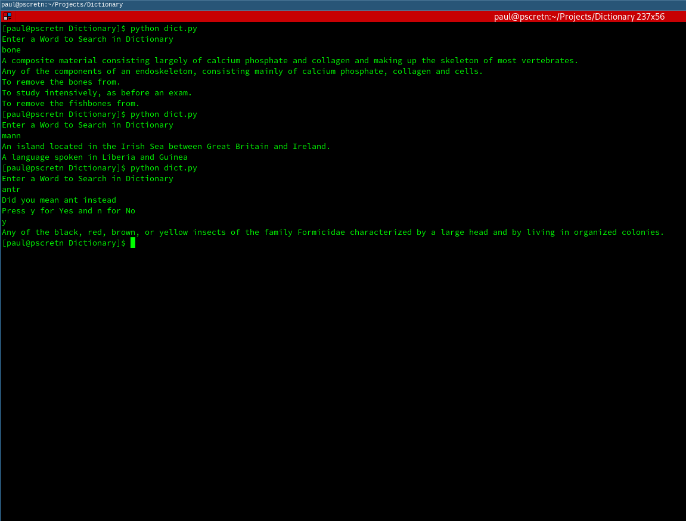

# Dictionary-Using-Python
Dictionary is a program written in python which can be used for searching word meaning . I had tried to overcome all the errors in program ,this dictionary
can get close matches for wrong word 
<br><br><br>
 to get started with dictionary ,  we need to import json and also import get_close_matches from difflib as shown below

```python
import json 
from difflib  import get_close_matches
```
# Program
```python
import json # inorder to work with json file first we need to import it
from difflib  import get_close_matches # inorder to use function named "get_close_matches" we need to import it from  module difflib

book = json.load(open("data.json")) # inorder to load and open json file we use 'json.load(open("json file to be opened "))' , we assign that json file to a container named book

def translate(x):
    if x.lower() in book: # here x.lower convert input into lower case and check in json file which is assigned as book
        return book[x.lower()] # if the condition get satisfy it will return book[x.lower()]

    elif x.upper() in book: # here x.upper convert input into upper case and check in json file which is assigned as book
        return book[x.upper()]

    elif x.title() in book: # here x.title convert input into first letter in upper case , other letters in lower case and check in json file which is assigned as book
        return book[x.title()]

    elif len(get_close_matches(x , book.keys())) > 0 : # here we will check for number of keys in json file book that is matching to useriput "x" , if it is greater than zero this condition will work 
        print("Did you mean %s instead" %get_close_matches(x , book.keys())[0]) # here we use '%s' to print string from 'get_close_matches'

        decide = input("Press y for Yes and n for No \n") # this userinput is used to check whether the user meaned it

        if(decide == "y"):
            return book[get_close_matches(x,book.keys())[0]]

        elif(decide == "n"):
            return ("Word not Found in Dictionary")

        else:
            return ("You had Entered a Wrong input")
    else:
        print("Word not Found in Dictionary")

x=input("Enter a Word to Search in Dictionary \n")

out = translate(x)

if type(out) == list: # function "type" is used to identify the type of varaible 
    for a in out: # here we used 'for' loop  for printing word with more than one meaning in different line
        print (a)

else:
    if out != None: # inorder to ignore printing "None" we have used this conditional
        print (out)
```
# Output
The Shown below images is the screenshot of program runned in linux terminal 
<br><br>

